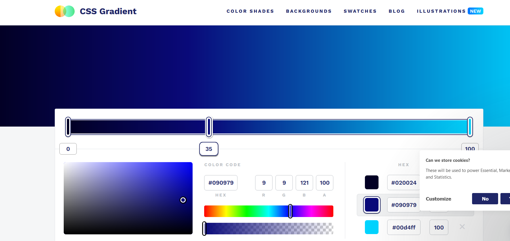
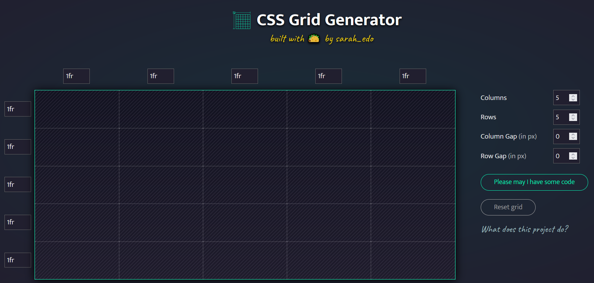
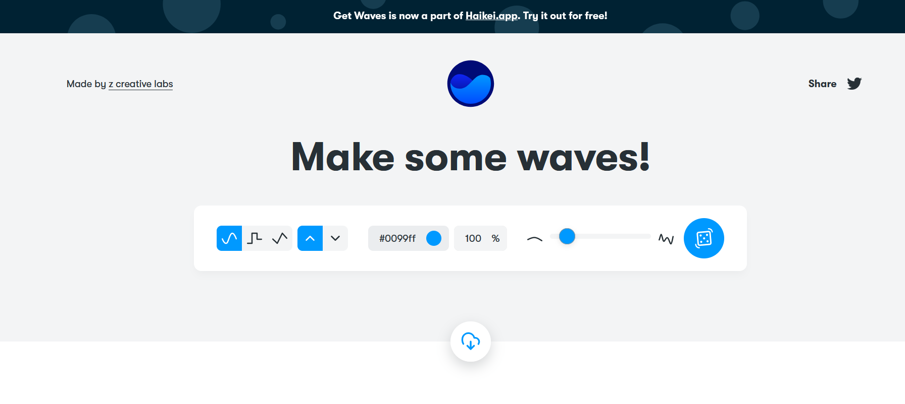
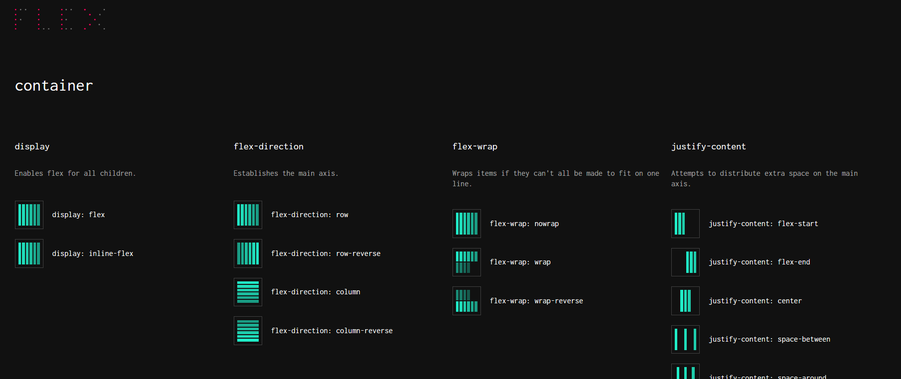

# Design
#### Colorpoint.io pallete to choose some color 
> 
[Link](https://www.colorpoint.io/beautiful-color-palettes/)

#### 119 color scheme
> 
[Link](http://vladimirchernyshov.ru/119-trendovyx-cvetov-dlya-sozdaniya-fantasticheskix-sajtov-na-50-zhivyx-primerax/)

#### Fishtext.ru generator 
>
[Link](https://fishtext.ru/index.php)

#### Neumorphism.io
>
[Link](https://neumorphism.io/#e0e0e0)

#### CSS Clip maker
>
[Link](https://bennettfeely.com/clippy/)

#### Animista.net
>
[Link](https://animista.net/)

#### Purgecss.com
>
[Link](https://purgecss.com/)

#### Shadow GENERATOR

[Link](https://shadows.brumm.af/)

#### CSSgradient.io

[Link](https://cssgradient.io/)

#### Grid Generator

[Link](https://cssgrid-generator.netlify.app/)

#### Waves generator

[Link](https://getwaves.io/)

#### FLexBox

[Link](https://flexbox.malven.co/)