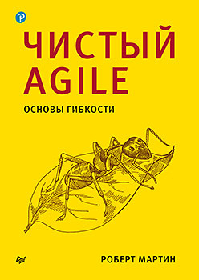
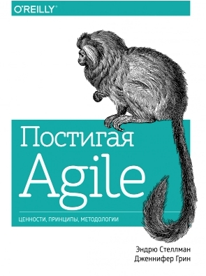

# Agile (By D.Koshelenko)

## Basic level

- [The Agile Manifesto](https://www.agilealliance.org/agile101/the-agile-manifesto)

> ### Чистый Agile. Основы гибкости
> Роберт Мартин\
> ISBN: 978-5-9614-3454-5\
> \
> 

> ### Постигая Agile
> Эндрю Стеллман, Дженнифер Грин\
> ISBN: 978-5-00100-614-5\
> \
> 

---
[return to main page](../README.md)
