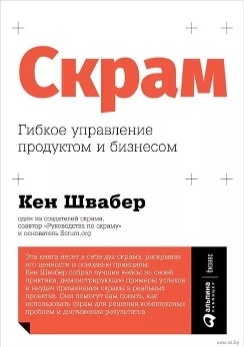
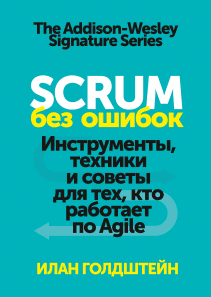

# Scrum (by D.Koshelenko)

## Basic level

- [scrum.org](https://www.scrum.org/)

> ### Scrum. Революционный метод управления проектами
> Джефф Сазерленд\
> ISBN: 978-5-00117-096-9\
> \
> 

> ### Scrum на практике
> Джей Джей Сазерленд\
> ISBN: 978-5-00169-260-7\
> \
> 

> ### Скрам. Гибкое управление продуктом и бизнесом
> Кен Швабер\
> ISBN: 978-5-9614-2546-8\
> \
> 

## Advanced level

> ### Scrum без ошибок
> Илан Голдштейн\
> ISBN: 978-5-00146-306-1\
> \
> 

---

[return to main page](../README.md)