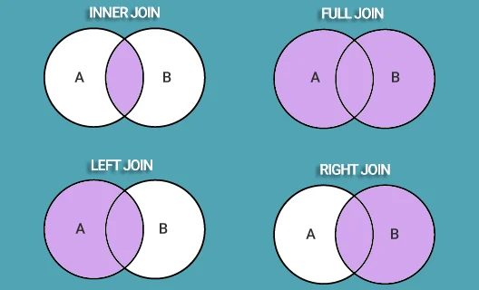

### 1. Что такое "Нормализация"?
Есть такое понятие как логическая избыточность. Это когда, например, в таблице пользователей есть столбец номер телефона. То есть у пользователя Х может быть только один номер телефона для связи. Но зачастую это неудобно: ведь номеров у человека может быть несколько.

В такой ситуации разумно вынести номер телефона в отдельную таблицу и организовать связь "Один-ко-многим" (у одного пользователя может быть несколько телефонных номеров)

То есть мы разбиваем таблицу на части или делаем декомпозицию, приводя таким образом таблицу к нормальной форме

Нормализация как раз и подразумевает собой процесс приведения базы данных к нормальным формам с целью избавления от логической избыточности, а декомпозиция - это одна из вариаций нормализации.

Нормальных форм существует аж 8: с 1NF и до 6NF а также Бойса-Кодда и Доменно-ключевая формы.

### 2. Есть ли преимущество у NoSQL над SQL?
Иногда можно добиться большего быстродействия у первого языка. Если кратко - преимущество есть в скорости выполнения запросов. Это связано с отсутствием связей и конкретной схемы в NoSQL.

Так MongoDB может выигрывать у PostrgeSQL в запросах, которые подразумевают много связей и за которыми постгрес полезет в другие таблицы, которые, вдобавок, могут оказаться очень большими.

### 3. Что такое транзакция?
Транзакция - это элементарная операция в базе данных.

Однако транзакция может состоять и из нескольких операций: в этом ключе - это логически целостная процедура, в которой должны быть выполнены либо все операции - либо ни одна из них.

Транзакция начинается с команды BEGIN и заканчивается командой COMMIT либо отменяется командой ROLLBACK

### 4. Требования, предъявляемые к транзакции. ACID
Согласно теории баз данных транзакции должны обладать следующими свойствами:

1. Атомарность (atomicity). Это свойство означает, что либо транзакция будет зафиксирована в базе данных полностью, т. е. будут зафиксированы результаты выполнения всех ее операций, либо не будет зафиксирована ни одна операция транзакции.

2. Согласованность (consistency). Это свойство предписывает, чтобы в результате успешного выполнения транзакции база данных была переведена из одного согласованного состояния в другое согласованное состояние.

3. Изолированность (isolation). Во время выполнения транзакции другие транзакции должны оказывать по возможности минимальное влияние на нее.

4. Долговечность (durability). После успешной фиксации транзакции пользователь должен быть уверен, что данные надежно сохранены в базе данных и впоследствии могут быть извлечены из нее, независимо от последующих возможных сбоев в работе системы.

Для обозначения всех этих четырех свойств используется аббревиатура ACID.

### 5. Выполнение транзакций
Можно выполнять транзакции последовательно или параллельно

И если в первом случае все понятно, то со вторым могут возникать "феномены", например:

1. Потерянное обновление (lost update)

Когда разные транзакции одновременно изменяют одни и те же данные, то после фиксации изменений может оказаться, что одна транзакция перезаписала данные, обновленные и зафиксированные другой транзакцией.

2. «Грязное» чтение (dirty read)

Транзакция читает данные, измененные параллельной транзакцией, которая еще не завершилась. Если эта параллельная транзакция в итоге будет отменена, тогда окажется, что первая транзакция прочитала данные, которых нет в системе.

3. Неповторяющееся чтение (non-repeatable read)

При повторном чтении тех же самых данных в рамках одной транзакции оказывается, что другая транзакция успела изменить и зафиксировать эти данные. В результате тот же самый запрос выдает другой результат.

4. Фантомное чтение (phantom read).

Транзакция повторно выбирает множество строк в соответствии с одним и тем же критерием. В интервале времени между выполнением этих выборок другая транзакция добавляет новые строки и успешно фиксирует изменения. В результате при выполнении повторной выборки в первой транзакции может быть получено другое множество строк.

### 6. Что такое аномалия сериализации?
Для двух транзакций, скажем, A и B, возможны только два варианта упорядочения при их последовательном выполнении:

1️⃣ сначала A, затем B

2️⃣ сначала B, затем A.

Причем результаты реализации двух вариантов могут в общем случае не совпадать. 

Например, при выполнении двух банковских операций — внесения некоторой суммы денег на какой-то счет и начисления процентов по этому счету — важен порядок выполнения операций.

Если изначально на счете было 1000 у.е. и первой операцией будет увеличение суммы на 1000 у.е., а второй — начисление процентов (10%), то тогда итоговая сумма будет больше (2200 у.е.), чем при противоположном порядке выполнения этих операций (2100 у.е.).

Если описанные операции выполняются в рамках двух различных транзакций, то оказываются возможными различные итоговые результаты, зависящие от порядка их выполнения.

Сериализация двух транзакций при их параллельном выполнении означает, что полученный результат будет соответствовать одному из двух возможных вариантов упорядочения транзакций при их последовательном выполнении. То есть мы знаем, что результат может быть либо 2100 у.е. либо 2200 у.е. - не иначе. Соответственно, аномалия сериализации — несоответствие результата ни одному из вариантов.

При этом нельзя сказать точно, какой из вариантов будет реализован. 

Если распространить эти рассуждения на случай, когда параллельно выполняется более двух транзакций, тогда результат их параллельного выполнения также должен быть таким, каким он был бы в случае выбора некоторого варианта упорядочения транзакций, если бы они выполнялись последовательно, одна за другой.

Конечно, чем больше транзакций, тем больше вариантов их упорядочения. Концепция сериализации не предписывает выбора какого-то определенного варианта. Речь идёт лишь об одном из них.

5. Аномалия сериализации (serialization anomaly)

Результат успешной фиксации группы транзакций, выполняющихся параллельно, не совпадает с результатом ни одного из возможных вариантов упорядочения этих транзакций, если бы они выполнялись последовательно.

### 7. Уровни изоляции в SQL
1. Read Uncommitted

Это самый низкий уровень изоляции. Согласно стандарту SQL на этом уровне допускается чтение «грязных» (незафиксированных) данных.

Однако в PostgreSQL требования, предъявляемые к этому уровню, более строгие, чем в стандарте: чтение «грязных» данных на этом уровне не допускается.

2. Read Committed

Не допускается чтение «грязных» (незафиксированных) данных. Транзакция может видеть только те незафиксированные изменения данных, которые произведены в ходе выполнения ее самой.

3. Repeatable Read

Не допускается чтение «грязных» (незафиксированных) данных и неповторяющееся чтение. В PostgreSQL на этом уровне не допускается также фантомное чтение.

4. Serializable

Не допускается ни один из феноменов, перечисленных выше, в том числе и аномалии сериализации.

Конкретный уровень изоляции обеспечивает сама СУБД с помощью своих внутренних механизмов. Его достаточно указать в команде при старте транзакции.

Однако программист может дополнительно использовать некоторые операторы и приемы программирования, например, устанавливать блокировки на уровне отдельных строк или всей таблицы.

### 8. Блокировки
Кроме поддержки уровней изоляции транзакций, многие СУБД позволяют также создавать блокировки данных как на уровне отдельных строк, так и на уровне целых таблиц.

Команда SELECT имеет предложение FOR UPDATE, которое позволяет заблокировать отдельные строки таблицы с целью их последующего обновления.

Если одна транзакция заблокировала строки с помощью этой команды, тогда параллельные транзакции не смогут заблокировать эти же строки до тех пор, пока первая транзакция не завершится, и тем самым блокировка не будет снята.

Таким образом если выполнять данную команду:

SELECT * FROM table_tame WHERE column_name ~ 'some text' FOR UPDATE;
на двух терминалах — сначала на одном — а затем на втором (с учетом начала транзакции BEGIN)

То можно заметить, что выполнение на втором терминале приостановится до тех пор пока не завершится транзакция первого терминала

При этом если на первом терминале выполнить какую-нибудь другую команду:

UPDATE table_name SET column_name = 'kek' WHERE column_value = 404;
То, перейдя на второй терминал станет видно, что там была, наконец, выполнена выборка, которая покажет уже измененные данные с учетом данной UPDATE-команды

Ловушка джокера
### 9. Индексы
Индекс – специальная структура данных, которая связана с таблицей и создаётся на основе её данных. Индексы создаются для повышения производительности функционирования базы данных.

Какие бывают индексы?

В-дерево

хеш

GiST

SP-GiST

GIN

BRIN

По умолчанию команда CREATE INDEX создаёт индексы типа В-дерево (эффективны в большинстве случаев)

Как можно создать индексы?

🔹 Индекс по столбцу (это чистая классика)

🔹 Индекс по нескольким столбцам

🔹 Уникальный индекс

🔹 Индекс на основе выражения

🔹 Частичный индекс

Для создания индекса используется примерно такой синтаксис:

```CREATE [UNIQUE] INDEX <index_name> ON <table_name> ( <column_name>, ... ) [STATEMENT] ;```
При этом:

для создания уникального индекса может использоваться слово UNIQUE

для создания выражения его записывают в скобках, например для создания выражения проверки индекса на нижний регистр можно написать так:

. . . ( lower( <column_name> ) ) ;
для создания частичного индекса после скобок запись продолжается, например для проверки на величину можно написать так:

. . . ( . . . ) WHERE <column_name> > 1000 ;
### 10. Планировщик
Это такой встроенный механизм в СУБД, перед выполнением запроса он формирует "план" выполнения запроса. Просмотреть план выполнения любого запроса можно с помощью команды EXPLAIN. Для детального понимания планов выполнения сложных запросов требуется опыт.

Планировщиком можно управлять с целью просмотра логики его работы и дальнейшей оптимизации запросов

### 11. Оптимизация запросов
Повлиять на скорость выполнения запроса можно различными способами. Я запомнил их так: изменить сам sql-запрос, обновить статистику планировщика, денормализация и 4 вариации изменения параметров планировщика:

изменение исходного кода запроса

обновление статистики, на основе которой планировщик строит планы

денормализация: создание временных таблиц или создание индексов

изменение параметров планировщика, управляющих выбором порядка соединения наборов строк

изменение параметров планировщика, управляющих выбором метода доступа к данным (enable_seqscan, enable_indexscan, enable_indexonlyscan, enable_bitmapscan)

изменение параметров планировщика, управляющих способом соединения наборов строк (enable_nestloop, enable_hashjoin, enable_mergejoin);

изменение параметров планировщика, управляющих использованием ряда операций: агрегирование на основе хеширования, материализация временных наборов строк, выполнение явной сортировки при наличии других возможностей.

### 12. Какие есть концепции масштабируемости БД
Я всегда выделял 2 основных. Это Шардирование и Репликация. В обоих случаях подразумевается наличие нескольких инстансов БД.

Для шардирования мы определяем срезы строк, которые будут храниться в конкретном инстансе, например для первого, это с 1 по 10 000, а для второго с 10 001 по 20 000 и так далее.

Репликация подразумевает создание одного инстанса-контроллера и нескольких инстансов-нод. То есть по сути это полное копирование СУБД на другой сервер. Таким образом контроллер сам будет решать в какую ноду и что ему записывать.

По статистике и, наверное, логике выборки данных SELECT в интернетах выполняются во много раз чаще, чем INSERT'ы, на этом фоне репликация выглядит привлекательнее.

Все выше сказанное относится к теме "Повышение отказоустойчивости". Вот пара статей про неё: раз, два

### 13. Что будет если сделать EXPLAIN ANALYZE DROP DATABASE POSTGRES
Ну и напоследок такой вопрос с подвохом: всё плохо будет, потому что из-за ANALYZE субд мало того что с радостью удалит главную бд, так она ещё и посчитает веса а также время выполнения данного действа.

То есть простой EXPLAIN показывает план а EXPLAIN ANALYZE его ещё и выполняет

### 14. Разница между DELETE и TRUNCATE
--такой операцией
delete from table_a;
--и такой
truncate table table_a;
Основное различие между обоими операторами заключается в том, что оператор DELETE FROM может использоваться в связке с оператором WHERE, а TRUNCATE TABLE — нет. Это означает, что мы можем удалить одну или несколько строк, используя оператор DELETE FROM, в то время как оператор TRUNCATE TABLE удаляет сразу всё содержимое таблицы. DROP же удаляет всю БД.

Команда DELETE — это DML-операция, которая удаляет записи из таблицы, соответствующие заданному условию:

DELETE FROM table_name WHERE condition;

При этом создаются логи удаления, то есть операцию можно отменить.

А вот команда TRUNCATE — это DDL-операция, которая полностью пересоздаёт таблицу, и отменить такое удаление невозможно:

TRUNCATE TABLE table_name;


### 15.Какие типы СУБД в соответствии с моделями данных вы знаете?
Этот вопрос по SQL предполагает не просто назвать, но и дать краткое описание каждому типу.

Существует несколько типов СУБД:

Реляционные, которые поддерживают установку связей между таблицами с помощью первичных и внешних ключей. Пример — MySQL.
Flat File — базы данных с двумерными файлами, в которых содержатся записи одного типа и отсутствует связь с другими файлами, как в реляционных. Пример — Excel.
Иерархические подразумевают наличие записей, связанных друг с другом по принципу отношений один-к-одному или один-ко-многим. А вот для отношений многие-ко-многим следует использовать реляционную модель. Пример — Adabas.
Сетевые похожи на иерархические, но в этом случае «ребёнок» может иметь несколько «родителей» и наоборот. Примеры — IDS и IDMS.
Объектно-ориентированные СУБД работают с базами данных, которые состоят из объектов, используемых в ООП. Объекты группируются в классы и называются экземплярами, а классы в свою очередь взаимодействуют через методы. Пример — Versant.
Объектно-реляционные обладают преимуществами реляционной и объектно-ориентированной моделей. Пример — IBM Db2.
Многомерная модель является разновидностью реляционной и использует многомерные структуры. Часто представляется в виде кубов данных. Пример — Oracle Essbase.
Гибридные состоят из двух и более типов баз данных. Используются в том случае, если одного типа недостаточно для обработки всех запросов. Пример — Altibase HDВ.

### 16. Что такое первичный ключ?
Первичный ключ или PRIMARY KEY предназначен для однозначной идентификации каждой записи в таблице и является строго уникальным (UNIQUE): две записи таблицы не могут иметь одинаковые значения первичного ключа. Нулевые значения (NULL) в PRIMARY KEY не допускаются. Если в качестве PRIMARY KEY используется несколько полей, их называют составным ключом.

Пример:

CREATE TABLE USERS (
  id INT NOT NULL,
  name VARCHAR (20) NOT NULL,
  PRIMARY KEY (id)
);

Здесь в качестве первичного ключа используется поле id.

### 17.Что такое СУБД?
Допустим, есть большая база данных, которой пользуются многие сотрудники: кто-то ищет информацию, а кто-то изменяет или даже удаляет её. Чтобы правильно обрабатывать все эти запросы, нужно специальное программное обеспечение, и именно такое ПО получило название системы управления базами данных (СУБД).

### 18.Когда используется PRIMARY KEY?
PRIMARY KEY — это первичный ключ, который используется в качестве основного ключа и может быть использован для связи с дочерней таблицей, содержащей внешний ключ.

### 19.А что такое внешний ключ?
Внешний ключ или FOREIGN KEY также является атрибутом ограничения и обеспечивает связь двух таблиц. По сути, это поле или несколько полей, которые ссылаются на PRIMARY KEY в родительской таблице.

Пример использования:
CREATE TABLE order (
  order_id INT NOT NULL,
  user_id INT,
  PRIMARY KEY (order_id),
  FOREIGN KEY (user_id) REFERENCES users(id)
);

В данном случае внешний ключ, привязанный к полю user_id в таблице order, ссылается на первичный ключ id в таблице users, и именно по этим полям происходит связывание двух таблиц.

### 20. Какие ещё ограничения вы знаете, как они работают и указываются?
SQL-ограничения (constraints) указываются при создании или изменении таблицы. Это правила для ограничения типа данных, которые могут храниться в таблице. Действие с данными не будет выполнено, если нарушаются установленные ограничения.

UNIQUE — гарантирует уникальность значений в столбце;
NOT NULL — значение не может быть NULL;
INDEX — создаёт индексы в таблице для быстрого поиска/запросов;
CHECK — значения столбца должны соответствовать заданным условиям;
DEFAULT — предоставляет столбцу значения по умолчанию.

### 21.Для чего используется ключевое слово ORDER BY?
Для сортировки данных в порядке возрастания (ASC) или убывания (DESC).

Пример использования:

SELECT * FROM user ORDER BY name DESC;

Выбираются пользователи, которые будут отсортированы по имени в порядке убывания. Дополните ответ на этот вопрос по SQL тем, что без указания DESC данные были бы отсортированы по умолчанию — в порядке возрастания:

SELECT * FROM user ORDER BY name;

### 22.Назовите четыре основных типа соединения в SQL
Чтобы объединить две таблицы в одну, следует использовать оператор JOIN. Соединение таблиц может быть внутренним (INNER) или внешним (OUTER), причём внешнее соединение может быть левым (LEFT), правым (RIGHT) или полным (FULL).

INNER JOIN — получение записей с одинаковыми значениями в обеих таблицах, т.е. получение пересечения таблиц.
FULL OUTER JOIN — объединяет записи из обеих таблиц (если условие объединения равно true) и дополняет их всеми записями из обеих таблиц, которые не имеют совпадений. Для записей, которые не имеют совпадений из другой таблицы, недостающее поле будет иметь значение NULL.
LEFT JOIN — возвращает все записи, удовлетворяющие условию объединения, плюс все оставшиеся записи из внешней (левой) таблицы, которые не удовлетворяют условию объединения.
RIGHT JOIN — работает точно так же, как и левое объединение, только в качестве внешней таблицы будет использоваться правая.

Рассмотрим пример соединения SQL таблиц с использованием INNER JOIN. Следующий запрос выбирает все заказы с информацией о клиенте:

SELECT Orders.OrderID, Customers.CustomerName
FROM Orders
INNER JOIN Customers ON Orders.CustomerID = Customers.CustomerID;

### 23.А что такое Self JOIN?
Такой вопрос тоже может прозвучать на собеседовании по SQL. Это выражение используется для того, чтобы таблица объединилась сама с собой, словно это две разные таблицы. Чтобы такое реализовать, одна из таких «таблиц» временно переименовывается.

Например, следующий SQL-запрос объединяет клиентов из одного города:

SELECT A.CustomerName AS CustomerName1, B.CustomerName AS CustomerName2, A.City
FROM Customers A, Customers B
WHERE A.CustomerID <> B.CustomerID
AND A.City = B.City
ORDER BY A.City;

### 24.Для чего нужен оператор UNION?
Он используется для объединения полученных данных из двух или более запросов, которые должны иметь одинаковое количество столбцов с одинаковыми типами данных и расположенных в том же порядке.

Пример использования:

SELECT column(s) FROM first_table
UNION
SELECT column(s) FROM second_table;

### 25.Как работают подстановочные знаки?
Это специальные символы, которые нужны для замены каких-либо знаков в запросе. Они используются вместе с оператором LIKE, с помощью которого можно отфильтровать запрашиваемые данные.

### 26.Какими бывают подстановочные знаки?
% — заменить ноль или более символов;
_ — заменить один символ.
Примеры:

SELECT * FROM user WHERE name LIKE '%test%';

Данный запрос позволяет найти данные всех пользователей, имена которых содержат в себе «test».

SELECT * FROM user WHERE name LIKE 't_est';

А в этом случае имена искомых пользователей начинаются на «t», после содержат какой-либо символ и «est» в конце.

### 27.Что делают псевдонимы Aliases?
SQL-псевдонимы нужны для того, чтобы дать временное имя таблице или столбцу. Это нужно, когда в запросе есть таблицы или столбцы с неоднозначными именами. В этом случае для удобства в составлении запроса используются псевдонимы. SQL-псевдоним существует только на время запроса.

Пример:

SELECT very_long_column_name AS alias_name
FROM table;

### 28.Для чего нужен оператор INSERT INTO SELECT?
Данный оператор копирует данные из одной таблицы и вставляет их в другую, при этом типы данных в обеих таблицах должны соответствовать.

Пример использования:

INSERT INTO second_table
SELECT * FROM first_table
WHERE condition;

### 29.Что такое нормализация и денормализация?
Нормализация отношений в SQL призвана организовать информацию в базе данных таким образом, чтобы она не занимала много места и с ней было удобно работать. Это удаление избыточных данных, устранение дублей, идентификация наборов связанных данных через PRIMARY KEY, etc.

Соответственно, денормализация является обратным процессом, который вносит в нормализованную таблицу избыточные данные.

### 30.Чем VARCHAR отличается от NVARCHAR?
Главное отличие в том, что VARCHAR хранит значения в формате ASCII, где символ занимает один байт, а NVARCHAR хранит значения в формате Unicode, где символ «весит» 2 байта. Тип VARCHAR следует использовать, если вы уверены, что в значениях не будет Unicode-символов. Например, VARCHAR можно применить к адресам электронной почты, состоящих из ASCII-символов.

## Practice
### 1. Как выбрать записи с нечётными Id?
Один из самых распространённых вопросов на собеседовании. SQL запрос для выбора записей с нечётными id должен выглядеть следующим образом:

SELECT * FROM sample WHERE id % 2 != 0;

Если остаток от деления id на 2 равен нулю, перед нами чётное значение, и наоборот.

### 2. Как найти дубли в поле email?
SELECT email, COUNT(email)
FROM customers
GROUP BY email
HAVING COUNT(email) > 1;

Функция COUNT() возвращает количество строк из поля email. Оператор HAVING работает почти так же, как и WHERE, вот только применяется не для всех столбцов, а для набора, созданного оператором GROUP BY.

### 3. При выборке из таблицы прибавьте к дате 1 день
SELECT DATE_ADD(date, 1 DAY) as new_date FROM table;

Функция DATE_ADD() прибавляет к дате заданный промежуток времени. Синтаксис выглядит следующим образом:

SELECT DATE_ADD(дата, INTERVAL что_прибавить) FROM имя_таблицы WHERE условие;

### 4. Выберите только уникальные имена
SELECT DISTINCT name FROM users;

SELECT DISTINCT возвращает разные значения, даже если в выбранном столбце есть дубли.

### 5. Найдите в таблице среднюю зарплату работников
SELECT AVG(salary) FROM workers;

Функция AVG() применяется только к числовым типам данных и возвращает среднее значение по столбцу.


### 6. А теперь получите список сотрудников с зарплатой выше средней
SELECT * FROM workers
WHERE salary > (SELECT AVG (salary) FROM workers);

### 7.Даны таблицы workers и departments. Найдите все департаменты без единого сотрудника
SELECT department_name
FROM workers w
RIGHT JOIN departments d ON (w.department_id = d.department_id)
WHERE first_name IS NULL;

### 8.Замените в таблице зарплату работника на 1000, если она равна 900, и на 1500 в остальных случаях
Замена значений — одна из наиболее часто встречаемых задач по SQL на собеседованиях. Решить её несложно:

UPDATE table SET salary =
CASE
WHEN salary = 900 THEN 1000
ELSE 1500
END;

Оператор UPDATE используется для изменения существующих записей. Но ответы на подобные вопросы с собеседований по SQL должны быть более развёрнутыми. Уточните,что после UPDATE следует указать, какие записи должны быть обновлены. В противном случае обновятся все записи в таблице.

В нашем примере условие задаётся через оператор CASE: если текущая зарплата равна 900, изменяем её на 1000, в остальных случаях — на 1500.

### 9.При выборке из таблицы пользователей создайте поле, которое будет включать в себя и имена, и зарплату
SELECT CONCAT(name, salary) AS new_field FROM users;

Функция CONCAT() используется для конкатенации (объединения) строк, неявно преобразуя при этом любые типы данных в строки.
