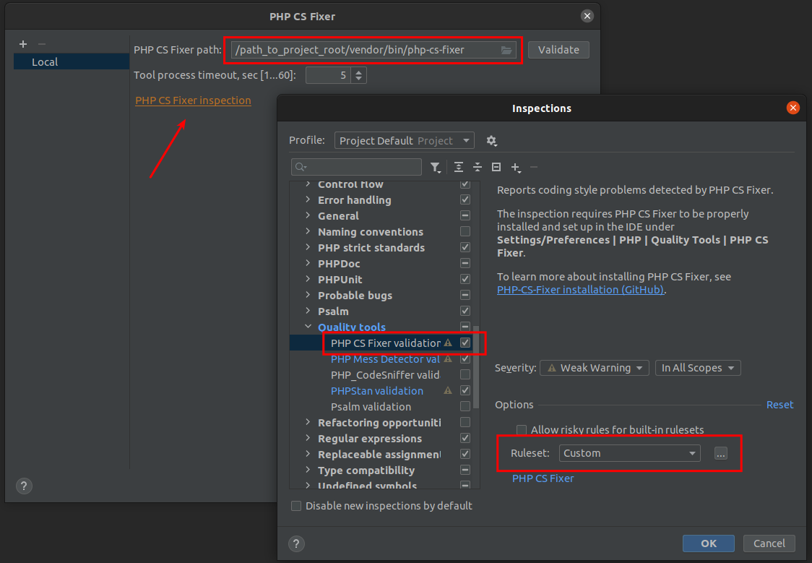

# PHP-CS-FIXER


The PHP Coding Standards Fixer (PHP CS Fixer) tool fixes your code to follow standards. See: [SensioLabs](https://cs.symfony.com)

### Install
You will need to install it into the project vendors to run in CI jobs:
```bash
$ composer require --dev friendsofphp/php-cs-fixer
```

### Settings
You should include our coding standard rules' [config file](.php-cs-fixer.dist.php) into the root of your project for the fixer
to use when fixing code. You may need to adjust the `Finder` paths to suite your project.

> For list of all rule sets visit https://mlocati.github.io/php-cs-fixer-configurato
>
> !!! You may ADD additional rules to your project, but you MUST NOT remove/disable any rules defined in our coding
> standard rules file above !!!

### Configure IDE


> The path will be 
```[path to composer root]/vendor/bin/php-cs-fixer```
> In inspection settings, select checkbox and choose a custom ruleset pointing to our setting file.



#### Run
```
$ vendor/bin/php-cs-fixer fix --config=.php-cs-fixer.dist.php -v --using-cache=no
```


#
[return to main page](../../README.md)