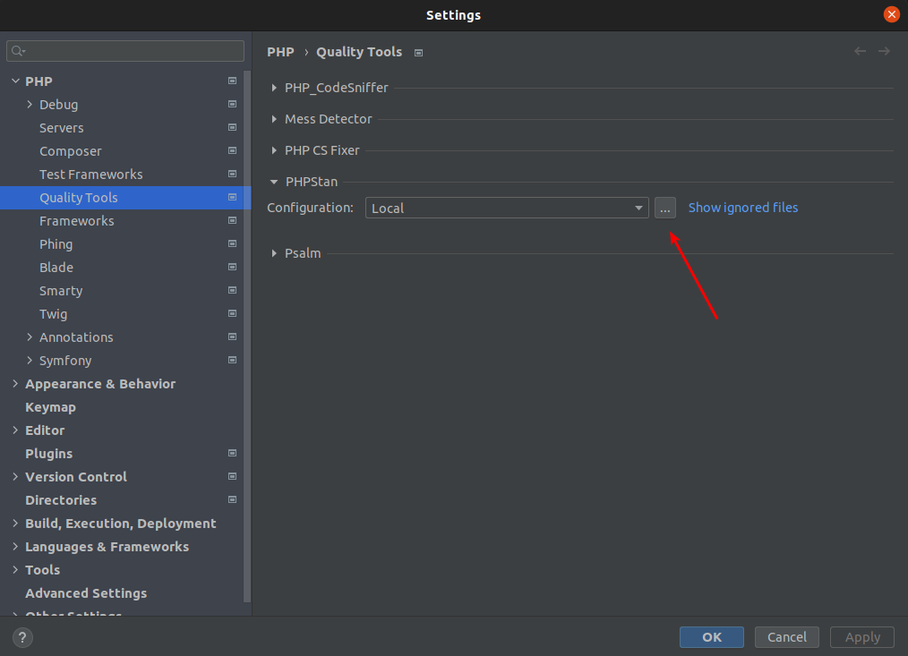
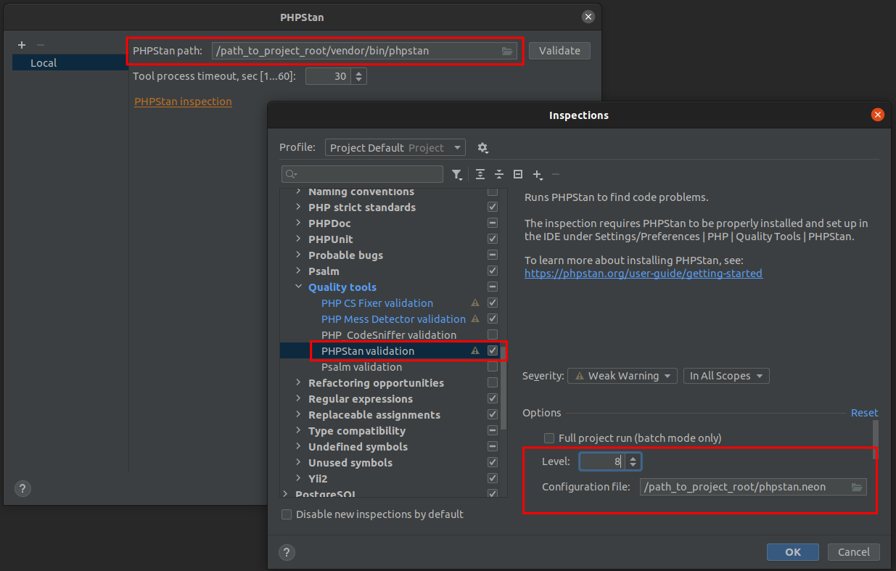

## PHP Stan
PHPStan finds bugs in your code without writing tests. See: [PHPStan](https://phpstan.org/)

### Install
You will need to install it into the project vendors to run in CI jobs:
```bash
$ composer require --dev phpstan/phpstan phpstan/phpstan-doctrine phpstan/phpstan-phpunit phpstan/phpstan-symfony
```

### Setting
Include the [config file](includes/phpstan.neon) into the root of your project for PHPStan to use.

#### Strict Rules and Webmozart (RECOMMENDED)
For those who want additional safety in extremely defensive programming, You will need to install next:

```bash
$ composer require --dev phpstan/phpstan-webmozart-assert phpstan/phpstan-strict-rules
```

Add rules to your *.neon config file:

```neon
includes:
    # ...
    # Additions
    - vendor/phpstan/phpstan-webmozart-assert/extension.neon
    - vendor/phpstan/phpstan-strict-rules/rules.neon
```

### Configure IDE



> The path will be `[path to composer root]/vendor/bin/phpstan`
>
> In inspection settings, select checkbox, choose level and custom ruleset pointing to our setting file.



### Run

```bash
$ vendor/bin/phpstan analyse -c phpstan.neon
```

### Inspection Level
When adding PHPStan to a huge project you may start at level 1 to avoid having to fix a lot of things all at once. As you fix the issues, gradually increase
the level to a maximum.

_All new projects should be set at highest level from the start._